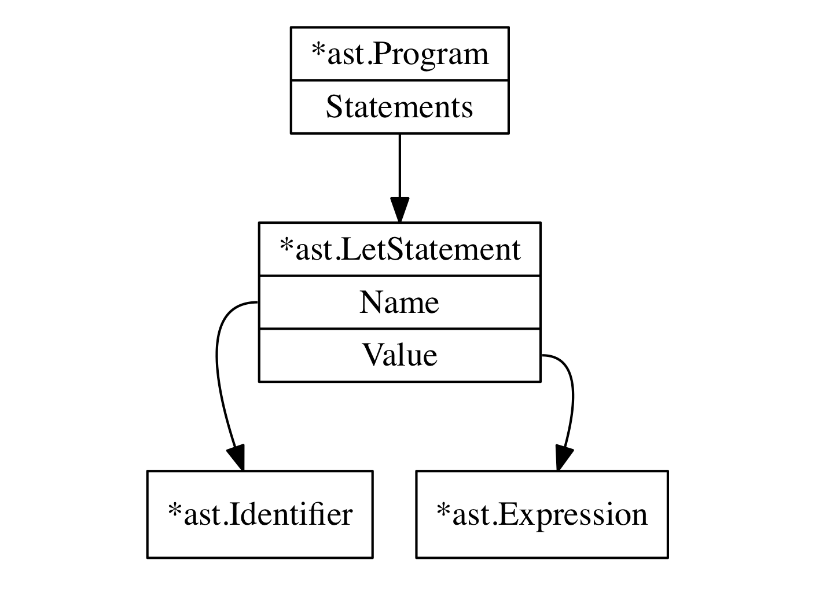

# 2.4解析器起步：解析LET语句
在Monkey中，变量绑定语句是如下的形式：
```
let x = 5;
let y = 10;
let foobar = add(5,5);
let barfoo = 5 * 5 / 10 + 18 - add(5,5) + multiply(124);
let anotherName = barfoo;
```
这些语句被称为“let 语句”，并且给定一个名字绑定一个值。`let x = 5;`绑定了5给x。在这个章节中我们的工作是正确解析let语句。

所以现在，我们将跳过解析产生给定变量绑定值的表达式，稍后再回来——只要我们知道如何让它们自己解析表达式。

正确解析let语句是什么意思？这意味着解析器生成一个AST来准确地表示原始let语句中包含的信息。这听起来很合理，但我们还没有AST，也不知道它应该是什么样子。所以我们的第一个任务是仔细查看Monkey源代码，看看它是如何构建的，这样我们就可以定义AST中能够准确表示let语句的必要部分。这是一个完全有效的用Monkey编写的程序：
```
let x = 10;
let y = 15;

let add = fn(a,b) {
    return a + b;
};
```
Monkey中的代码是一系列语句。在这个例子中哦我们能看见三个语句，三个变量绑定-let语句-如下形式：
```
let <identifier> = <expression>;
```
Monkey中的let语句由两个变化组成：标识符和表达式。在上面的例子中，x，y和add是标识符。10，15和函数文字是表达式。

在我们继续之前，有必要就语句和表达式之间的不同说几句。表达式会产生值，语句不会。让x=5不会产生值，而5会(它产生的值为5)。return5；语句不会产生值，但add(5,5)会。这种区别——表达式产生值，语句不会——根据你问的人而变化，但它足以满足我们的需求。

一句话精确到为一个表达式或一个语句，它产生就分为无值和有值，取决于编程语言。在某些语言中，函数字面量(例如：fn(x,y){return x + y;})是表达式，可以允许任何其他表达式的任何地方使用。在其他编程语言中，尽管函数文字只能是程序顶层的函数声明语句的一部分。一些语言也有“if 表达式”，其中条件是表达式并产生一个值。 这完全取决于语言设计者所做的选择。 正如你将看到的，Monkey 中的很多东西都是表达式，包括函数字面量。

回到我们的AST，看一下下面的例子，我们可以看到它需要两个不同的根类型：表达式(expressions)和语句(statements)。开始看我们的AST：
```go
// ast.ast.go

package ast

type Node interface {
    TokenLiteral() string
}

type Statement interface {
    Node
    statementNode()
}

type Expression interface {
    Node
    expressionNode()
}
```
在这里我们有三个接口叫Node,Statement和Expression。我们每个AST的节点必须实现Node接口，意味着它必须提供一个TokenLiteral()方法来返回与其关联的token的字面值。TokenLiteral()将仅用于调试和测试。我们将要构建的AST仅由相互连接的节点组成——毕竟它是一棵树。其中一些节点实现了Statement和一些Expression接口。这些接口分别称为statementNode和expressionNode的虚拟方法。它们不是绝对必要的，但通过指导Go编译器并可能导致它在我们使用语句时抛出错误来帮助我们，反之亦然。

这是我们实现的第一个Node：
```go
// ast/ast.go

type Program struct {
    Statements []Statement
}

func (p *Program) TokenLiteral() string {
    if len(p.Statements) > 0 {
        return p.Statements[0].TokenLiteral()
    } else {
        return ""
    }
}
```
Program 节点将会变成我们解析器产生的每个AST根节点。每条生动的Monkey编程都是一系列语句。这些语句包含在Program.Statements中，它只是实现Statement接口的AST节点的一部分

定义了AST构造的这些基本结构后，让我们考虑一下以`let x = 5;`形式的变量绑定节点可能是什么样子。它应该有哪些字段？绝对是变量名称之一。并且它还需要一个指向等号右侧表达式的字段。它需要能够指向任何表达式。它不能只指向一个字面值(这种情况下字面量是5)，因为每个表达式在等号后都是有效的：`let x = 5 * 5`和`let y = add(2,2) * 5`一样有效。然后节点还需要跟踪AST节点关联的token，所以我们可以实现TokenLiteral()方法。。这产生了三个字段：一个用于标识符，一个用于在let语句中产生值的表达式，一个用于token。
```go
// ast/ast.go

import "monkey/token"

//[...]

type LetStatement struct {
	Token token.Token // the token.LET token
	Name  *Identifier
	Value Expression
}

func (ls *LetStatement) statementNode()       {}
func (ls *LetStatement) TokenLiteral() string { return ls.Token.Literal }

type Identifier struct {
	Token token.Token // the token.IDENT token
	Value string
}

func (i *Identifier) expressionNode()      {}
func (i *Identifier) TokenLiteral() string { return i.Token.Literal }
```
LetStatement已经有了我们需要的字段：用于保存绑定标识符和用于生成值的表达式的值的名称。 两种方法statementNode和TokenLiteral分别满足Statement和Node接口。

为了保存绑定的标识符，让x=5;中的x，我们有Identifier结构类型，它实现了Expression接口。但是let语句中的标识符不会产生值，对吗？所以为什么它是一个表达式呢？这是为了让事情变得简单。Monkey程序其他部分的标识符会产生值，例如：let x = valueProducingIdentifier;。并且为了保持不同节点类型的数量较少，我们将在此处使用I标识符来表示变量绑定中的名称，然后重用它，将标识符表示为完整表达式的一部分或完整表达式。

随着`Program`,`letStatement`和`Identifier`定义了这样一段Monkey的源代码：
```
let x = 5;
```
可以由一个看起来这样的AST代表：


现在我们知道了它看起来是怎样的，下一步是构建这样一个AST，没有进一步的ado这里是我们解析器的开头：
```go
// parser/parser.go

package parser

import (
	"monkey/ast"
	"monkey/lexer"
	"monkey/token"
)

type Parser struct {
	l      *lexer.Lexer

	curToken  token.Token
	peekToken token.Token
）

func New(l *lexer.Lexer) *Parser{
    p := &Parser{;:l}

    // Read two tokens, so curToken and peekToken are both set
    p.nextToken()
    p.nextToken()

    return p
}

func (p *Parser) nextToken() {
    p.curToken = p.peekToken
    p.peekToken = p.l.NextToken()
}

func (p *Parser) ParseProgram() *ast.Program {
    return nil
}

```
解析器有三个字段，l,curToken和peekToken。l是指向词法分析器实例的指针，我们在其上反复调用NextToken()以获取输入中的下一个token。curToken和peekToken就像我们的词法分析器具有的两个"指针"一样：position和peekPosition。但是相反指向输入中的一个字符，它们指向当前和下一个标记。两者都很重要：我们需要查看curToken，也就是当前未检查的token，来决定下一步做什么，如果curToken没有给我们足够的信息，我们还需要peekToken来做这个决定。想想一行值包含5；。然后curToken是token.INT，我们需要peekToken来决定我们是在行尾还是在算数表达式的开头。

New函数是不言自明的，而nextToken方法是一个小帮手，它同时推进了curToken和peekToken。但是目前ParseProgram是空的。

现在在我们开始写我们的测试并填写ParseProgram方法之前，我想给你展示构建在递归下降解析器背后的基本思想和结构。这使得以后更容易理解我们自己的解析器。下面是这种解析器伪代码的主要部分。仔细阅读并尝试了解parseProgram函数发送了什么：
```
function parseProgram() {
    program = newProgramASTNode()
    
    advanceTokens()
    for (currentToken() != EOF_TOKEN) {
        statement=null

        if(currentToken()==LET_TOKEN) {
            statement = parseLetStatement()
        } else if (currentToken() == RETURN_TOKEN){
            statement = parseReturnStatement()
        } else if(currentToken() == IF_TOKEN) {
            statement = parseIfStatement()
        }

        if (statement != null) {
            program.Statements.push(statement)
        }
        advanceTokens()
    }
    return program
}

function parseLetStatement() {
    advanceTokens()

    identifier = parseIdentifier()

    advanceTokens()
    
    if currentToken() != EQUAL_TOKEN {
        parseError("no equal sign!")
        return null
    }

    advanceTokens()

    value = parseExpression()

    variableStatement = newVariableStatementASTNode()
    variableStatement.identifier = identifier
    variableStatement.value = value
    return variableStatement
}

function parseIdentifier() {
    identifier = newIdentifierASTNode()
    identifier.token = currentToken()
    return identifier
}

function parseExpression() {
    if (currentToken() == INTEGER_TOKEN) {
        if (nextToken() == PLUS_TOKEN) {
            return parseOperatorExpression()
        } else if (nextToken() == SEMICOLON_TOKEN) {
            return parseIntegerLiteral()
        }
        } else if (currentToken() == LEFT_PAREN) {
    return parseGroupedExpression()
}
// [...]
}
function parseOperatorExpression() {
    operatorExpression = newOperatorExpression()

    operatorExpression.left = parseIntegerLiteral()
    operatorExpression.operator = currentToken()
    operatorExpression.right = parseExpression()
    
    return operatorExpression()
}
// [...]
```

由于这是伪代码，当然有很多遗漏。 但是递归下降解析背后的基本思想就在那里。 入口点是parseProgram，它构造了AST的根节点（newProgramASTNode()）。 然后它通过调用其他函数来构建子节点和语句，这些函数知道基于当前标记构建哪个 AST 节点。这些其他函数再次递归地相互调用。

其中最递归的部分是在 parseExpression 中，并且只是被暗示了。 但是我们已经可以看到，为了解析像 5 + 5 这样的表达式，我们需要先 parse5 + 然后再次调用 parseExpression() 来解析其余的，因为 + 之后可能是另一个运算符表达式，像这样：5 + 5 * 10. 稍后我们将详细介绍表达式解析，因为它可能是解析器中最复杂但也是最漂亮的部分，大量使用了“Pratt 解析”。

但是现在，我们已经可以看到解析器必须做什么。 它反复推进token并检查当前token以决定下一步做什么：调用另一个解析函数或抛出错误。 然后每个函数完成它的工作并可能构造一个 AST 节点，以便 parseProgram() 中的“主循环”可以推进标记并决定再次做什么

如果您查看该伪代码并认为“嗯，这实际上很容易理解”我有个好消息要告诉您：我们的 ParseProgram 方法和解析器看起来非常相似！让我们开始工作吧！

再一次，我们从之前的测试开始 我们充实了ParseProgram。 这是一个测试用例，以确保 let 语句的解析有效：
```go
// parser/parser_test.go
package parser

import (
	"monkey/ast"
	"monkey/lexer"
	"testing"
)

func TestLetStatements(t *testing.T) {
    input := `
let x = 5;
let y = 10;
let foobar = 838383;
`
    l := lexer.New(input)
    p := New(l)

    program := p.ParseProgram()
    if program == nil {
        t.Fatalf("ParseProgram() returned nil")
    }
    if len(program.Statements) != 3 {
        t.Fatalf("program.Statements does not contain 3 statements. got=%d",
            len(program.Statements))
    }

    tests := []struct {
        expectedIdentifier string
    }{
    {"x"},
    {"y"},
    {"foobar"},
}

    for i, tt := range tests {
        stmt := program.Statements[i]
        if !testLetStatement(t, stmt, tt.expectedIdentifier) {
            return
        }
    }
}

func testLetStatement(t *testing.T, s ast.Statement, name string) bool {
    if s.TokenLiteral() != "let" {
        t.Errorf("s.TokenLiteral not 'let'. got=%q", s.TokenLiteral())
        return false
    }

    letStmt, ok := s.(*ast.LetStatement)
    if !ok {
        t.Errorf("s not *ast.LetStatement. got=%T", s)
        return false
    }

    if letStmt.Name.Value != name {
        t.Errorf("letStmt.Name.Value not '%s'. got=%s", name, letStmt.Name.Value)
        return false
    }

    if letStmt.Name.TokenLiteral() != name {
        t.Errorf("s.Name not '%s'. got=%s", name, letStmt.Name)
        return false
    }

    return true
}
```
测试用例遵循与词法分析器的测试以及我们将要编写的几乎所有其他单元测试相同的原则：我们提供 Monkey 源代码作为输入，然后对我们想要的 AST 设置期望——这是由解析器生成的 - 看起来像。 我们通过检查尽可能多的 AST 节点字段来确保没有遗漏任何内容。 我发现解析器是一个错误的基地，它的测试和断言越多越好。

我选择不模仿或存根词法分析器并提供源代码作为输入而不是tokens，因为这使测试更具可读性和理解性。当然，词法分析器中的错误会导致解析器的测试失败并产生不必要的错误，但我认为风险太小了，尤其是根据使刻度源代码作为输入的优势来判断。

这个测试用例有两个值得注意的地方。第一个是我们忽略了*ast.LetStatement的字段值，为什么我么们不检查整数字(5,10...)是否被解析正确？回答是，我们即将这样做。但首先我们要保证let的解析语句起作用并忽略值。

第二个是辅助函数testLetStatement。它可能看起来过于工程化使用一个分离函数，但我们很快就需要这个函数。然后就是将会使我们的测试用例比散落的类型转换的行和行更具可读性。

还有一点：我们将不会在本章查看所有解析器测试，因为它们太长了。但是本书的代码将包含这些。

话虽如此，但测试如期失败：
```go
$ go test ./parser
--- FAIL: TestLetStatements (0.00s)
parser_test.go:20: ParseProgram() returned nil
FAIL
FAIL monkey/parser 0.007s
```

是时候填充在Paser中的ParseProgram()方法了。
```go
// parser/parser.go

func (p *Parser) ParseProgram() *ast.Program {
    program := &ast.Program{}
    program.Statements = []ast.Statement{}

    for p.curToken.Type != token.EOF {
        stmt := p.parseStatement()
            if stmt != nil {
                program.Statements = append(program.Statements, stmt)
            }
        p.nextToken()
    }

    return program
}
```
这看起来是不是很像我们之前看到的parseProgram()伪代码函数？看！我告诉你了！它的作用也是一样的。

ParseProgram做的第一件事是构造AST的根节点，一个*ast.Program.它然后遍历每一个tokens，直到遇到token.EOF标记。它通过重复调用nextToken来实现这一点，它同时推进p.curToken和p.peekToken。每次迭代中，它都会调用parseStatement，它的工作是解析语句。如果parseStatement返回nil以外的东西，一个ast.Statement，它的返回值被添加到AST根节点的切片。当没有任何东西可以解析时，将返回 *ast.Program根节点。

parseStatement方法如下所示：
```go
// parser/parser.go

func (p *Parser) parseStatement() ast.Statement {
    switch p.curToken.Type {
        case token.LET:
            return p.parseLetStatement()
        default:
            return nil
    }
}
```
别担心，switch语句将会有跟多的分支。但是现在，仅仅只有一个叫parseLetStatement语句当它的情况为token.LET token时。并且parseLetStatement是我们的测试由红色变为绿色的方法：
```go
// parser/parser.go

func (p *Parser) parseLetStatement() *ast.LetStatement {
    stmt := &ast.LetStatement{Token: p.curToken}

    if !p.expectPeek(token.IDENT) {
        return nil
    }

    stmt.Name = &ast.Identifier{Token: p.curToken, Value: p.curToken.Literal}

    if !p.expectPeek(token.ASSIGN) {
        return nil
    }

    // TODO: We're skipping the expressions until we
    // encounter a semicolon
    for !p.curTokenIs(token.SEMICOLON) {
        p.nextToken()
    }

    return stmt
}

func (p *Parser) curTokenIs(t token.TokenType) bool {
    return p.curToken.Type == t
}
func (p *Parser) peekTokenIs(t token.TokenType) bool {
    return p.peekToken.Type == t
}

func (p *Parser) expectPeek(t token.TokenType) bool {
    if p.peekTokenIs(t) {
        p.nextToken()
        return true
    } else {
        return false
    }
}
```
它工作了！测试变绿了！
```go
$ go test ./parser
ok monkey/parser 0.007s
```
我们能解析let语句了！太美妙了，但是等等，怎么样？

让我们从parseLetStatement开始。它使用当前所在的token(token.LET)构造一个*ast.LetStatement节点，然后在通过调用expectPeek对下一个token进行断言的同时推进token。首先它需要一个token.IDENT token，然后它使用它来构造一个 *ast.Identifier节点，然后它期待一个等号，最后它跳过等号后面的表达式，直到遇到一个分号。表达式的跳过将被替换，当然，之后我们知道如何解析它们。

curTokenls和peekTokenls方法不需要太多解释。它们是有用的方法，我们将在充实解析器时一次又一次地看到它们。我们已经可以用!p.curTokenls(token.EOF)替换ParseProgram中的for循环的p.curToken.Type != token.EOF条件。

与其剖析这些微小的方法，不如让我们谈谈expectPeek。expectPeek方法是几乎所有解析器共享的"断言函数"之一。它们的主要目的是通过检查下一个token的类型来强制执行token顺序的正确性。我们的expextPeek在这里检查peekToken的类型，只有当类型正确时，它才会通过调用nextToken来推进token。正如你将看到的，这是解析器经常做的事情。

但是如果我们在expectPeek中遇到一个不是与其类型的token会发生什么？目前，我们只返回nil，它在ParseProgram中被忽略，导致整个由于输入错误，语句被忽略。默默地，你大概可以想象这使调试变得非常困难。由于没有人喜欢艰难的调试，我们需要向我们的解析器添加错误处理。

值得庆幸的是，我们需要做的改变很小：
```go
// parser/parser.go
type Parser struct {
// [...]
    errors []string
// [...]
}

func New(l *lexer.Lexer) *Parser {
    p := &Parser{
        l: l,
        errors: []string{},
    }
// [...]
}

func (p *Parser) Errors() []string {
    return p.errors
}

func (p *Parser) peekError(t token.TokenType) {
    msg := fmt.Sprintf("expected next token to be %s, got %s instead",
        t, p.peekToken.Type)
    p.errors = append(p.errors, msg)
}
```
Parser现在有了errors字段，它只是一个字符串切片。该字段在New函数中初始化并且辅助函数peekError现在可用于在错误时添加错误。peekToken的类型与预期不符。使用Errors方法，我们可以检查解析器遇到任何错误。解析器遇到任何错误。

扩展测试套件以使用它与你期望的一样简单：

```go
// parser/parser_test.go

func TestLetStatements(t *testing.T) {
// [...]

    program := p.ParseProgram()
    checkParserErrors(t, p)

// [...]
}
func checkParserErrors(t *testing.T, p *Parser) {
    errors := p.Errors()
    if len(errors) == 0 {
        return
    }

    t.Errorf("parser has %d errors", len(errors))
    for _, msg := range errors {
        t.Errorf("parser error: %q", msg)
    }
    t.FailNow()
}
```
新的checkParseErrors辅助函数只是检查解析器是否有错误。如果有的话，打印出错误测试并停止执行当前的测试。很直接。但是我们的解析器没有错误的话，通过改变expectPeek，我们可以自动添加每次我们对下一个token的期望错误时都会出现错误:
```go
// parser/parser.go

func (p *Parser) expectPeek(t token.TokenType) bool {
    if p.peekTokenIs(t) {
        p.nextToken()
        return true
    } else {
    p.peekError(t)
        return false
    }
}
```
如果我们现在改变我们的测试用例输入:
```go
input := `
let x = 5;
let y = 10;
let foobar = 838383;
`
```
到此输入无效，其中缺少token
```go
    input := `
let x 5;
let = 10;
let 838383;
`
```
我们能运行我们的测试来看我们的新的解析错误：
```go
$ go test ./parser
--- FAIL: TestLetStatements (0.00s)
    parser_test.go:20: parser has 3 errors
    parser_test.go:22: parser error: "expected next token to be =,\
        got INT instead"
    parser_test.go:22: parser error: "expected next token to be IDENT,\
        got = instead"
    parser_test.go:22: parser error: "expected next token to be IDENT,\
        got INT instead"
FAIL
FAIL monkey/parser 0.007s
```
正如你所看到的，我们的解析器在这里展示了一个简洁的小功能：它为我们遇到的每个错误语句提供错误信息。它不会在第一个退出，这可能会为我们节省一次又一次重新运行解析过程以捕获所有语法错误的繁重工作。这非常有用-即使缺少行号和列号。
|[< 2.3为Monkey语言写一个解析器](2.3.md)|[> 2.5解析返回语句](2.5.md)|
|-------|-----|

