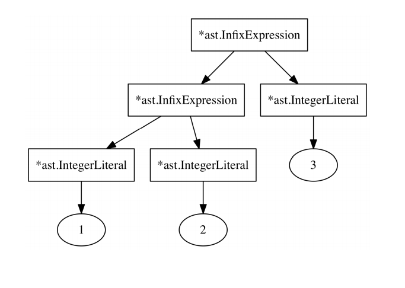
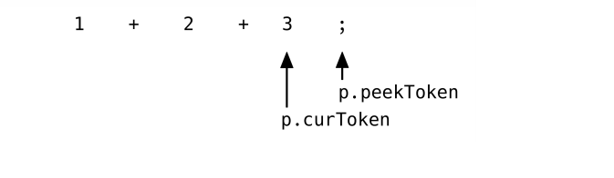

# Pratt解析是如何运行的？
parseExpression 方法背后的算法及其解析函数的组合 Vaughan Pratt 在他的“自上而下的运算符优先级”论文中详细描述了优先级。 但是他的实现和我们的实现是有区别的。

Partt 不使用一个解析器结构并且也不传递定义在*Parser上方法。它也不适用maps，当然他也没有使用Go。他的论文比Go早36年发表。然后还有命名差异：我们所说的prefixParseFns是“nuds”(对于“null denotations”)。infixParseFns是“leds”(用于“左表示”)。

尽管用伪代码表示，我们的parseExpression方法看起来与Pratt论文中的代码惊人地相似。它使用相同的方法，几乎没有任何变化。我们将跳过回答其工作原理的理论，只关心它是如何工作的以及如何工作通过查看示例，所有部分(parseExpression、解析函数和优先级)都组合在一起。假设我们正在解析以下表达式语句：
```go
1 + 2 + 3;
```
在这里大的挑战现在不是每个运算符和AST中的结果数，而是正确嵌套AST的节点。我们想要的是一个AST(序列化为字符串)看起来像这样：

```go
((1 + 2) + 3)
```
AST需要两个*ast.InfixExpression节点。树种较高的 *ast.InfixExpression应该将整数文字3作为其右边子节点，而其左节点需要是另一个 *ast.InfixExpression。第二个 *ast.InfixExpression然后需要分别将整数文字1和2作为其左子节点和右节点。像这样：



并且这就是我们解析器的精确输出的东西当它解析`1 + 2 + 3;`但是怎么样？我们将回答这个问题在下一个段落。我们将近距离看一下我们解析器做了什么当parseExpressionStatement被第一次调用。在阅读一下段落时打开代码并没有错。

所以我们启程了。这里是当我们解析1 + 2 + 3;时发生的东西。

parseExpressionStatement调用parseExpression(LOWEST)。p.curToken和p.peekToken分别是1和第一个+号；


parseExpression将要做的第一件事是检查是否有一个prefixParseFn联系和当前是否为token.INT的p.curToken.Type。并且，当然有parseIntegerLiteral。所以它调用parseIntegerLiteral，它返回*ast.IntegerLiteral。parseExpression将此分配给leftExp。

然后来自新的for循环在parseExpression。它情况的评估是正确的：
```go
for !p.peekTokenIs(token.SEMICOLON) && precedence < p.peekPrecedence() {
// [...]
}
```
p.peekToken不是一个token.SEMICOLON并且peekPrecedence(返回+的token的优先级)高于传递给parseExpression的参数，后者是LOWEST。这是我们的在此定义优先级再次刷新我们的记忆：
```go
// parser/parser.go
const (
    _ int = iota
    LOWEST
    EQUALS // ==
    LESSGREATER // > or <
    SUM // +
    PRODUCT // *
    PREFIX // -X or !X
    CALL // myFunction(X)
)
```
所以评估是正确的情况并且parseExpression执行循环体，它看起来像这样：
```go
infix := p.infixParseFns[p.peekToken.Type]
if infix == nil {
    return leftExp
}

p.nextToken()

leftExp = infix(leftExp)
```
现在它获取 p.peekToken.Type 的 infixParseFn，它是在 *Parser 上定义的 parseInfixExpression。 在调用它并将其返回值分配给 leftExp（重用 leftExp 变量！）之前，它会推进token，因此它们现在看起来像这样：


对于处于这种状态的tokens，它调用 parseInfixExpression 并传入已解析的 *ast.IntegerLiteral（在 for 循环外分配给 leftExp）。 解析 InfixExpression 中接下来发生的事情是事情变得有趣的地方。 这里又是方法：
```go
// parser/parser.go
func (p *Parser) parseInfixExpression(left ast.Expression) ast.Expression {
    expression := &ast.InfixExpression{
        Token: p.curToken,
        Operator: p.curToken.Literal,
        Left: left,
    }

    precedence := p.curPrecedence()
    p.nextToken()
    expression.Right = p.parseExpression(precedence)

    return expression
}
```
需要注意的是，左边是我们已经解析的 *ast.IntegerLiteral ，它代表了1。

parseInfixExpression保存了p.curToken的优先级(第一个+token)，推进token并调用parseExpression-传入刚刚保存的优先级。所以现在parseExpression被第二次调用，tokens如下：

parseExpression 再次做的第一件事是为 p.curToken 寻找一个 prefixParseFn。 并且再一次 parseIntegerLiteral。 但是现在 for 循环的条件不评估为真：优先级（传递给 parseExpression 的参数）是第一个 + 运算符的优先级1 + 2 + 3，不小于 p.peekToken 的优先级，第二个 + 运算符。 他们是是平等的。 for 循环体不执行， *ast.IntegerLiteral 表示 2 返回。

现在回到 parseInfixExpression 中，将 parseExpression 的返回值分配给 Right 新构造的 *ast.InfixExpression 的字段。 所以现在我们有这个：

这个 *ast.InfixExpressions 由 parseInfixExpression 返回，现在我们回到对 parseExpression 的最外层调用，这里的优先级仍然是最低的。 我们回到了开始的地方，再次评估 for 循环的条件。
```go
for !p.peekTokenIs(token.SEMICOLON) && precedence < p.peekPrecedence() {
// [...]
}
```
这次评估仍然是正确的，因为优先级是LOWEST并且peekPrecedence现在返回在我们表达式里的第二个+，它的优先级更高。parseExpression评估第二次循环的循环体。现在leftExp不是代表1的 *ast.IntegerLiteral，而是 parseInfixExpression返回的 *ast.InfixExpression，代表
1 + 2。

在循环体中，parseExpression 获取 parseInfixExpression 作为 p.peekToken.Type（第二个 +）的 infixParseFn，推进标记并以 leftExp 作为参数调用 parseInfixExpression。 parseInfixExpression 依次再次调用 parseExpression，这
返回最后一个 *ast.IntegerLiteral（表示表达式中的 3）。 

毕竟，在循环体的末尾，leftExp 看起来像这样：


运算符和操作数嵌套正确！ 而我们的tokens看起来像这样：


for循环的评估情况是错误的：
```go
for !p.peekTokenIs(token.SEMICOLON) && precedence < p.peekPrecedence() {
// [...]
}
```

现在p.peekTokenIs(token.SEMICOLON) 评估是正确的，这会阻止循环体再次执行。

（对 p.peekTokenIs(token.SEMICOLON) 的调用不是绝对必要的。我们的 peekPrecedence 如果找不到 p.peekToken.Type 的优先级，方法将返回 LOWEST 作为默认值 - token.SEMICOLON token就是这种情况。 但我认为它使分号的行为作为表达式结束分隔符更明确和更容易理解。）

并且，这就是，for循环结束了，leftExp返回了。我们回到parseExpressionStatement并且到了结尾和正确处理*ast.InfixExpression。并且这在 *ast.ExpressionStatement 中用作表达式。

现在我们知道了我们的解析器如何正确解析`1 + 2 + 3`，这非常令人兴奋，不是吗？我认为优先级和peekPrecedence是有尤其令人兴奋的。

但是考虑一下“真正的优先级问题”？在我们的例子中每个操作符(+)有相同的优先级。不同优先级的实现怎么做呢？我们不能只是默认情况下使用 LOWEST 并为所有运算符使用称为 HIGHEST 的东西？

不，因为那样会给我们一个错误的AST，目标是使设计具有较高优先级的运算符表达式比具有较低优先级运算符的表达式在树中更深。这是通过parseExpression中的优先级值(参数)完成的。

当 parseExpression 被调用时，优先级的值代表当前 parseExpression 调用的当前“右侧绑定能力”。 “右侧绑定能力”是什么意思？ 好吧，它越高，当前表达式（未来的窥视标记）右侧的token/运算符/操作数就越多，我们可以“绑定”到它，或者像我想的那样，“吸入”。 

如果我们目前的右侧绑定能力是最高可能的值，我们到目前为止解析的
（分配给 leftExp）永远不会传递给与下一个运算符（或token）。 它永远不会成为“左”子节点。 因为 for 循环的条件从不评估为真。

存在右侧绑定能力的对应物，它被称为（你猜对了！）“左绑定能力”。 但是哪个值表示这种左绑定能力？ 既然 parseExpression 中的 precedence 参数代表的是当前的右绑定能力，那么下一个运算符的左绑定能力从何而来？ 简单地说：从我们对 peekPrecedence 的调用开始。 此调用返回的值代表 p.peekToken 的下一个运算符的左绑定能力。

这一切都归结为我们的 for 循环的优先级 < p.peekPrecedence() 条件。 这条件检查下一个操作符/token的左绑定能力是否高于我们当前的
右侧绑定能力。 如果是，那么我们到目前为止解析的内容会被下一个操作符“吸入”，从从左到右，最终被传递到下一个运算符的 infixParseFn。

一个例子，让我们看一下我们解析表达式语句`-1 + 2;`我们想要的AST现在是(-1) + 2,而不是-(1+2)。使用的第一个方法（在 parseEx pressionStatement 和 parseExpression 之后）是我们与 token.MINUS 关联的 prefixParseFn：解析前缀表达式。 为了刷新我们对 parsePrefixExpression 的记忆，它是完整的：
```go
// parser/parser.go
func (p *Parser) parsePrefixExpression() ast.Expression {
    expression := &ast.PrefixExpression{
        Token: p.curToken,
        Operator: p.curToken.Literal,
    }
    p.nextToken()
    expression.Right = p.parseExpression(PREFIX)
    return expression
}
```
这将 PREFIX 作为优先级传递给 parseExpression，将 PREFIX 转换为该 parseExpression 调用的右绑定功能。 根据我们的定义，PREFIX 是一个非常高的优先级。 这样做的结果是 parseExpression(PREFIX) 永远不会解析 -1 中的 1 并将其传递给另一个 infixParseFn。 precedence < p.peekPrecedence() 永远不会为真。在这种情况下，意味着没有其他 infixParseFn 会将我们的 1 作为左臂。 相反，1 作为前缀表达式的“右”臂返回。 只是 1，而不是其他一些表达紧随其后，需要解析。

回到对 parseExpression 的外部调用（其中我们将 parsePrefixExpression 称为 prefixParseFn)，紧跟在第一个 leftExp := prefix() 之后，优先级的值仍然是 LOWEST。 因为这是我们在最外层调用中使用的值。 我们的右侧绑定能力仍然是最低的。 p.peekToken 现在是 -1 + 2 中的 +。

我们现在坐在 for 循环的条件上并评估它以确定我们是否
应该执行循环体。 事实证明 + 运算符的优先级
（由 p.peekPrecedence() 返回）高于我们当前的右侧绑定能力。 我们到目前为止解析的（-1 前缀表达式）现在传递给与 + 关联的 infixParseFn。+ 的左绑定力“吸收”了我们到目前为止解析的内容并将其用作“左臂”它正在构建的 AST 节点。

+ 的 infixParseFn 是 parseInfixExpression，它现在使用 + 的优先级作为调用 parseExpression 时的权利约束力。 它不使用 LOWEST，因为那会导致另一个+具有更高的左束缚力并“吸走”我们的“右臂”。 如果
确实如此，那么像 a + b + c 这样的表达式会导致 (a + (b + c))，这不是我们想要的。 我们想要 ((a + b) + c)。

前缀运算符的高优先级起作用了。 它甚至适用于中缀运算符。在运算符优先级 1 + 2 * 3 的经典示例中，* 的左绑定能力为高于+的右结合力。 解析这将导致 2 被传递给与 * 标记关联的 infixParseFn。

值得注意的是，在我们的解析器中，每个标记都具有相同的左右绑定力。 我们只是使用一个值（在我们的优先级表中）作为两者。 该值的含义取决于上下文。

如果运算符应该是右关联而不是左关联（在 + 的情况下导致 (a + (b + c)) 而不是 ((a + b) + c)，那么我们必须使用更小的“右绑定能力”在解析运算符表达式的“右臂”时。 如果你考虑 ++ 和 -- 其他语言中的运算符，它们可以用在前缀和后缀位置，您 可以理解为什么有时为运算符设置不同的左右绑定权限是有用的。

由于我们没有为运算符定义单独的左右绑定能力，而仅使用一个值，我们不能仅仅改变一个定义来实现这一点。 但是，作为一个例子，让 +右关联我们可以在调用 parseExpression 时递减它的优先级：
```go
// parser/parser.go

func (p *Parser) parseInfixExpression(left ast.Expression) ast.Expression {
    expression := &ast.InfixExpression{
        Token: p.curToken,
        Operator: p.curToken.Literal,
        Left: left,
    }

    precedence := p.curPrecedence()
    p.nextToken()
    expression.Right = p.parseExpression(precedence)
    // ^^^ decrement here for right-associativity
    return expression
}
```
出于演示目的，让我们暂时更改此方法，看看会发生什么：
```go
// parser/parser.go
func (p *Parser) parseInfixExpression(left ast.Expression) ast.Expression {

    expression := &ast.InfixExpression{
        Token: p.curToken,
        Operator: p.curToken.Literal,
        Left: left,
    }

    precedence := p.curPrecedence()
    p.nextToken()

    if expression.Operator == "+" {
        expression.Right = p.parseExpression(precedence - 1)
    } else {
        expression.Right = p.parseExpression(precedence)
    }

    return expression
}
```
进行此更改后，我们的测试告诉我们 + 正式右结合：
```go
$ go test -run TestOperatorPrecedenceParsing ./parser
--- FAIL: TestOperatorPrecedenceParsing (0.00s)
    parser_test.go:359: expected="((a + b) + c)", got="(a + (b + c))"
    parser_test.go:359: expected="((a + b) - c)", got="(a + (b - c))"
    parser_test.go:359: expected="(((a + (b * c)) + (d / e)) - f)",\
        got="(a + ((b * c) + ((d / e) - f)))"
FAIL
```
这标志着我们深入了解 parseExpression 的结束。 如果你还在
不确定和无法理解它是如何工作的，别担心，我也有同感。 什么真正有帮助正在将跟踪语句放在 Parser 的方法中以查看发生了什么解析某些表达式。 在本章附带的代码文件夹中，我包含了一个名为 ./parser/parser_tracing.go 的文件，我们之前没有看过。 该文件包括当试图理解解析器的作用时，两个函数定义非常有用：跟踪和不跟踪。 像这样使用它们：
```go
// parser/parser.go

func (p *Parser) parseExpressionStatement() *ast.ExpressionStatement {
    defer untrace(trace("parseExpressionStatement"))
// [...]
}
func (p *Parser) parseExpression(precedence int) ast.Expression {
    defer untrace(trace("parseExpression"))
// [...]
}
func (p *Parser) parseIntegerLiteral() ast.Expression {
    defer untrace(trace("parseIntegerLiteral"))
// [...]
}
func (p *Parser) parsePrefixExpression() ast.Expression {
defer untrace(trace("parsePrefixExpression"))
// [...]
}
func (p *Parser) parseInfixExpression(left ast.Expression) ast.Expression {
    defer untrace(trace("parseInfixExpression"))
// [...]
}
```
包含这些跟踪语句后，我们现在可以使用我们的解析器并查看它的作用。 这里是解析测试套件中的表达式语句-1 * 2 + 3时的输出：
```go
$ go test -v -run TestOperatorPrecedenceParsing ./parser
=== RUN TestOperatorPrecedenceParsing
BEGIN parseExpressionStatement
    BEGIN parseExpression
        BEGIN parsePrefixExpression
            BEGIN parseExpression
                BEGIN parseIntegerLiteral
                END parseIntegerLiteral
            END parseExpression
        END parsePrefixExpression
        BEGIN parseInfixExpression
            BEGIN parseExpression
                BEGIN parseIntegerLiteral
                END parseIntegerLiteral
            END parseExpression
        END parseInfixExpression
        BEGIN parseInfixExpression
            BEGIN parseExpression
                BEGIN parseIntegerLiteral
                END parseIntegerLiteral
            END parseExpression
        END parseInfixExpression
    END parseExpression
END parseExpressionStatement
--- PASS: TestOperatorPrecedenceParsing (0.00s)
PASS
ok monkey/parser 0.008s
```
|[> 2.6解析表达式](2.6.md)|[> 2.8扩展解析器](2.8.md)|
|-|-|